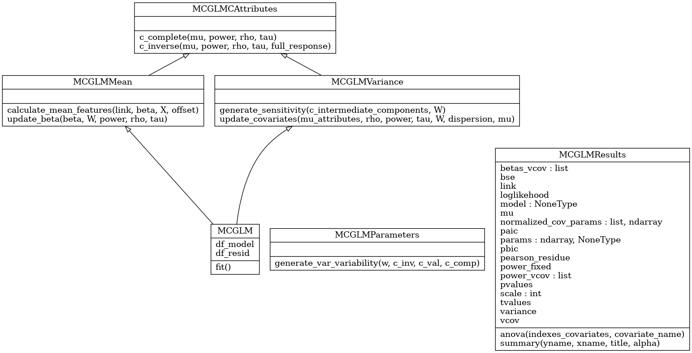

# Abstract

Multivariate Covariance Generalized Linear Models (McGLM) are an extension of 
classic generalized linear models that allow analysis of multivariate and 
non-independent response variables. Due to its flexibility and explicit 
specification, McGLM supports many statistical analyses across a wide variety 
of data and distinct traits. To promote the use of McGLM for statistical analysis, 
we introduce the `mcglm` library, a new Python library.

The `mcglm` library provides a comprehensive platform for data analysis using 
the McGLM framework. It inherits the standards of the `statsmodels` library, 
providing a comprehensive summary report for fitting assessment that includes 
regression and dispersion coefficients, confidence intervals, hypothesis testing, 
residual analysis, goodness-of-fit measurements, and correlation coefficients 
between outcomes. In addition, the library provides a rich set of link and 
variance functions and tools to define inner-response dependency matrices 
through the matrix linear predictor. The base code is both extendable and 
reliable thanks to good object-oriented programming practices and unit testing.

The library is hosted on PyPI and can be installed with the aid of some Python 
library manager, such as `pip`.

# Introduction

Dated at the beginning of the 19th century and controversial about actual 
authorship, the least squares method established an optimization algorithm 
[@10.1214/aos/1176345451]. According to the Gauss-Markov theorem 
[@Gauss-Marc], the resulting estimates are optimal and unbiased under 
linear conditions. This optimization method forms the basis of linear 
regression, one of the earliest statistical models [@galton:1886; @linearregression:1982]. 
Linear regression associates a response variable to a group of covariates 
by employing a linear operation on regression coefficients 
[@10.2307/2333849]. Three main assumptions for linear regression are 
linearity, independent realizations of the response variable, and a Gaussian 
homoscedastic error with a zero mean. In the subsequent years, many other 
proposals have aimed to generalize these assumptions; however, the least 
squares method and its application in linear regression still significantly 
impact statistical modeling and data analysis. 

The statistical modeling literature is concentrate on extending the linear 
model allowing more realistic assumptions. [-@glm:1972] proposed the 
Generalized Linear Model (GLM) which relieves the Gaussian assumption 
allowing for exponential family models [@GLM:2004]. Similarly, 
the Generalized Additive Model (GAM) [@GAM:1986] eases the linear 
assumption by using covariates smooth functions. The Generalized Estimating 
Equations (GEE) [@Zeger:1988] applies the quasi-likelihood estimating 
functions to deal with dependent data. Other consolidated frameworks to 
deal with dependent data include Copulas [@Krupskii:2013; @Masarotto:2012], 
and Mixed Models [@Verbeke:2014], among others. One prevalent aspect 
of the cited frameworks is that they cannot deal with multiple response variables.

The Multivariate Covariance Generalized Linear Model (McGLM) [@Bonat:2016] 
extends the GLM by allowing the multivariate analysis of non-independent 
responses, such as longitudinal and spatial data. This versatility is the main 
trait of the McGLM framework. The models are specified using only second-moment 
assumptions through the specification of five components: the linear predictor 
via design matrix, link function, variance function, covariance link function, 
and the matrix linear predictor. The model allows the assessment of regression 
and dispersion coefficients, hypothesis tests, goodness-of-fit measurements, 
and correlation coefficients between response variables.

The McGLM framework is available for R users through the 
open-source package `mcglm` [@Bonat:2016b]; nevertheless, the language 
Python had not had a standard library until `mcglm`. The foremost 
library statistical analysis in Python is the `statsmodels` 
[@Seabold:2010]; it implements classical statistical models, such as: GLM, 
GAM, GEE, and Copulas, however McGLM is not available. Many other libraries 
stand out for probabilistic programming in Python 
[@probabilisticp:2018], such as: `PyMC` [@pymc3:2016], `Pyro` 
[@pyro:2018], and `PyStan` [@stan:2017]. Those libraries 
distinguish from `statsmodels` on their bayesian paradigm of specifying 
models. The library `mcglm` specifies the McGLM from a frequentist fashion.

The library `mcglm` provides an easy interface for fitting McGLMs 
on the standards of `statsmodels` [@Seabold:2010] library. It 
provides a comprehensive framework for statistical analysis supported by 
McGLMs, with tools to lead its model specification, fitting, and appropriate 
report to assess estimates.

# Implementation

McGLMs are specified by five components: linear predictors, link functions, 
variance functions, matrix linear predictors and covariance link functions. 
In this section, we discuss usual choice for each of these components.

McGLMs allows the specification of usual linear predictors from standard linear 
models including interactions terms and the usual formula notation popular in 
many statistical software. Similarly, the link function is specified as in the 
GLM framework usual choices are logit and probit for binary and binomial data, 
log for count data and identity for continuos real data.

The variance function is fundamental to the MCGLMs, as it is related to the 
marginal distribution of the response variable. To underscore some common 
choices, the variance function power specialized in handling 
continuous data and defines the Tweedie family of distributions. 
According to @bent:1987 and @bent:1997, this family has its 
special cases: Gaussian (p = 0), Gamma (p = 2), and Inverse Gaussian (p = 3). 
The variance function extended binomial is a common choice for 
analyzing bounded data. For fitting count data, the dispersion function presented 
by @kokonendji:2015, called Poisson-Tweedie, is flexible to 
capture notable models, such as: Hermite (p = 0), Neyman Type A (p = 1), 
Negative Binomial (p = 2) and Poisson inverse Gaussian (p = 3). The following 
table summarizes the mentioned variance functions:

\begin{table}[h]
\centering
\label{tab:methods}
\begin{tabular}{ll} \hline
Function name            & Formula  \\ \hline
\texttt{Tweedie/Power}  & $\mathrm{V}(.;p) = \mu^{p}$\\
\texttt{Binomial}   & $\mathrm{V}(.;p) = \mu^{p} (1 - \mu)^{p}$\\
\texttt{Poisson-Tweedie}   & $\mathrm{V}(.;p) = \mu + \mu^{p}$\\ \hline
\end{tabular}
\caption{Table with variance functions}
\end{table}

To describe the covariance structure the user specifies the dependency through 
the Z matrices in the matrix linear predictor. Many of the classical statistical 
models are replicable by setting tailored Z matrices. To cite a few, 
mixed models, moving averages, and compound symmetry. For more details, see 
@Bonat:2016 and @Bonat:2018. Finally, @Bonat:2018 proposed 
three covariance link functions namely: identity, inverse and exponential-matrix.

# The Python library mcglm

The library `mcglm` provides the first Python tool for statistical analysis with 
the aid of McGLMs. Heavily influenced by its twin R version 
[@Bonat:2018], the library has ninety-one percent of unit-testing 
coverage. URLs of source-code and PyPI, the official repository for Python 
libraries, are https://github.com/jeancmaia/mcglm and https://pypi.org/project/mcglm/. 
The library `mcglm` can easily be installed with the aid of library `pip`.

The `mcglm` library is based on popular libraries of scientific Python 
programming: The `NumPy` [@harris2020array], `scipy` [@2020SciPy-NMeth], 
and `scipy.sparse`. We inherit `statsmodels`'s interface and deliver a 
code library akin to their standards API. Object-oriented programming is 
another cornerstone for the library `mcglm`; the SOLID principles 
[@Madasu:2015] helped to create a readable and extensible code-base. 
The UML diagram \autoref{fig:umlcode} presents `mcglm` library architecture.

The implementation `mcglm` lies in six classes: `MCGLM`, `MCGLMMean`, `MCGLMVariance`, 
`MCGLMCAttributes`, `MCGLMParameters` and `MCGLMResults`. Each class has its 
own scope and responsibilities. For in-depth details, access the code-base 
https://github.com/jeancmaia/mcglm.

We adopted the `statsmodels` standards of attribute names, the endog argument 
is a vector, or a matrix, with the realizations of the response variable; the 
exog statement defines the covariates through design matrices. For multiple 
outcomes, endog and exog must be specified via Python lists. The z 
argument establishes dependency arrays, defined through `numpy` array structures.

Arguments link and variance set the link and variance functions, respectively. 
For the former, the available options are Identity, Logit, Power, Log, Probit, 
Cauchy, Cloglog, Log-log, NegativeBinomial, and Inverse Power - all canonical 
options for GLM. Suitable options for the variance are Constant, Tweedie, 
BinomialP, BinomialPQ, Geometric-Tweedie, and Poisson-Tweedie. The default 
values for link and variance functions are identity and constant, suitable 
picks for a Gaussian models. For multiple outcomes, link and variance must 
be specified via Python lists.

The offset argument is suitable for either continuous or count outcomes. In 
addition, parameter ntrial is the canonical number of trials for binomial data. 
Finally, parameter power_fixed activates searching for the power parameter for Tweedie 
models. For multiple outcomes, parameters must be specified via Python lists.

An instantiated object can fit a model with the aid of the fit() method, which 
returns an object of the `MCGLMResults` class. This object can trigger two 
methods: summary(), a comprehensive report of estimates on the `statsmodels` fashion 
and anova(), to an ANOVA test for categorical covariates. Some other attributes may 
be helpful, such as mu, which returns a vector with expected values; pearson_residuals 
for the Pearson normalized residuals; aic, bic and loglikelihood for model comparison.

Moreover, library `mcglm` provides methods to assist specifying the matrix linear 
predictor through dependence matrices Z. There are three available methods: 
mc_id(), which crafts a matrix for independent realizations of outcome, mc_mixed(), 
which builds matrices for mixed models, and mc_ma() that build matrices for moving 
average fitting, popular models in time series analysis. The package `mcglm` of R 
language implements similar methods to aid on the matrix linear predictor specification. 
For in-depth details about those matrices, see [@Bonat:2016].

The library can be installed in any Python environment that fulfills 
the requirements listed on PyPI Webpage; with `pip` assistant is seamless 
to get the library.

# Discussion

This article introduces the implementation of the McGLM framework in Python, providing 
a flexible statistical modeling approach for fitting a wide range of models. The `mcglm` 
library, which extends the `statsmodels` library, offers an accessible interface for 
accessing estimated parameters and goodness-of-fit measures.

As a new alternative for statistical analysis in Python, the `mcglm` library can be 
published in the `statsmodels` library as a new API. While the library is limited in 
its inability to choose the covariance link function, its exclusive implementation of 
the identity covariance link function allows the fit of numerous models listed in the 
statistical literature. The library's object-oriented development philosophy provides 
a readable, extensible, self-contained, and testable implementation that is ideal for 
developing statistical models.

One significant difference between the `mcglm` library and existing R language packs is 
the use of object-oriented development, which proves to be suitable for statistical model 
production. While mixed models and copulas are similar statistical tools, the `mcglm` 
library's ability to analyze multiple responses sets it apart. We suggest conducting a 
comparative analysis of statistical tools, exploring different model specifications 
in the future. With `statsmodels` implementing complementary models, Python is a suitable 
environment for performing this analysis.

# References
